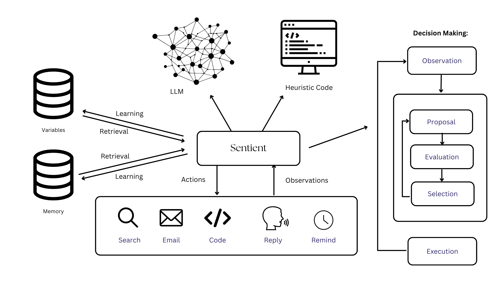

# Sentient (WIP)

## Description

Sentient is a cognitive personal assistant. It has a backend architecture based on a new agentic framework, and a chat interface that allows users to seamlessly interact with it. 

The actions that Sentient can perform are:
- Searching the web
- Using a headless browser (without GUI)
- Emailing / Reading emails
- Automations
- etc.

## How to use

The easiest way to use the assistant is to sign up for the released version here: https://trysentient.ai/

If you want to build it yourself, you can follow this information

This repository contains sub-repositories for the frontend and backend. You can clone the entire repository, or choose to clone the components seperately. 

### Frontend

1. Clone the frontend repository
2. Install dependencies: `npm install`
3. Start the frontend: `npm start`

### Backend

1. Clone the backend repository
2. Install dependencies: `pip install -r requirements.txt`
3. Start the backend: `python app.py`

## How it works

The AI system adds additional cognitive modules to the LLM which allows us to be more realiable. Here is a brief overview of how they work:

### Knowledge 

Sentient stores information that it gains - through user input and the internet - in an embedding-based format. This means that knowledge is condensed into segments with embeddings as headings, allowing for relevant and efficient retreivel. 

### Reasoning

Sentient uses LLMs to explicitly reason through its existing knowledge and expand the explicit knowledge that is has, allowing Sentient to make better decisions with more knowledge.

### Memory

The platform explicitly stores knowledge and user-specific variables, letting the platform get better at context-aware tasks over time. 

